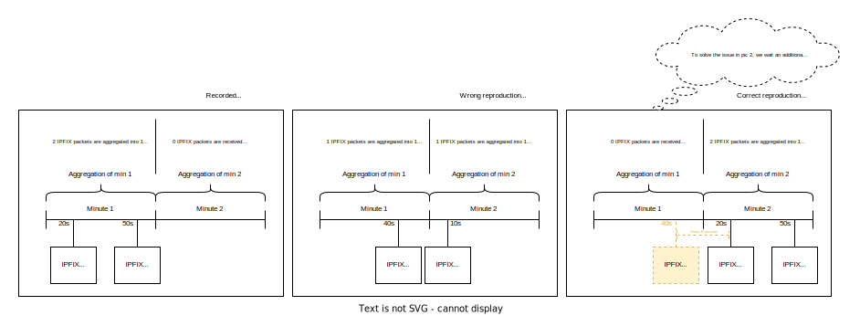

# Traffic reproducer

Given a PCAP and a simple configuration file, the tool can reproduce the traffic to a collector. This can be useful, for example, to debug a collector with a recording from some production routers.

TODO: rewrite all readme

## Features

- Reproduce IPFIX, BMP and BGP
- Simulates respecting the speed of the PCAP
- Simulates multiple clients via multiple configurable IPs
- Support for VRF in linux
- Easy integration with new protocols
- BGP_ID replaced correctly for perfect correlation
- Generation of a new pre-filtered PCAP for faster performance

## Installation

You need to run the software with Python 3.7 or newer. We suggest to create a virtual environment and use the `requirements.txt` file to install the correct packages
```
python3 -m venv venv
source venv/bin/activate
pip install -r requiremements.txt
```

## Usage

First step is to record a PCAP, then to create a configuration file for the PCAP, and finally to run the program

### Record PCAP

You can use `tcpdump` tool in Linux to record a PCAP. The simplest command is as follows:

```
tcpdump -vvv -w one.pcap
```

This will record from a default interface any packet and will write a PCAP file into `one.pcap`. Thanks to `-vvv` you will see the number of packets captured so far

A more realistic example is as follows:

```
tcpdump -vvv -i vrf300  -n host 10.0.0.1 -w ./two.pcap
```

With `-i vrf300` `tcpdump` listens only to interface named `vrf300`. With `-n host 10.0.0.1` `tcpdump` is going to filter packets coming from or going to IP 10.0.0.1.

### Configuration file

You can use the file `examples/config.yml` as skeleton for you configuration. For more explanation, check comments in place

### Run the program

```sh
> python main.py -h
usage: main.py [-h] -t--test TEST_PATH [-w--write WRITE] [-v] [-d] [--no-sync]

Reproduce BGP, BMP and IPFIX traffic from pcap with minimal changes

optional arguments:
  -h, --help           show this help message and exit
  -t, --test TEST_PATH Test YAML file - see test.yml.example
  -w, --write WRITE    Output file if you want to pre-filter. No packets will be sent
  -v, --verbose        Logging in INFO mode
  -d, --debug          Logging in DEBUG mode
  --no-sync            Disable initial IPFIX sync
```


Some collectors will do aggregation at a minute bucketing (e.g. pmacct). In other words, some collectors will accumulate IPFIX data from second 0 to second 59 of each minute, and then will aggregate and send the aggregated data. As such, the position of the IPFIX in the minute is very important (please, refer to the following image to better understand the problem). That is why before sending the first IPFIX message, the reproducer will wait to sync the minute as in the PCAP. This behaviour can be disabled with `--no-sync`.



## Add a new protocol

If you want to add a new protocol, you will need to change:

- `proto.py`, where the supported protocols are listed
- `proto_client.py`, where the logic for the protocol is placed. In particular, you will need to implement a new class with two methods: `should_filter` (given a packet, should return True if you want to filter the packet, or False), and `get_payload`, which would return the payload that will be sent by the socket. In the main, you should also define the socket (if UDP or TCP):
```py
super().__init__(
    collector,
    client,
    socket.socket(socket.AF_INET, socket.SOCK_DGRAM)
)
```
- `client.py`: the `__init__` method initializes the `proto_client` class
